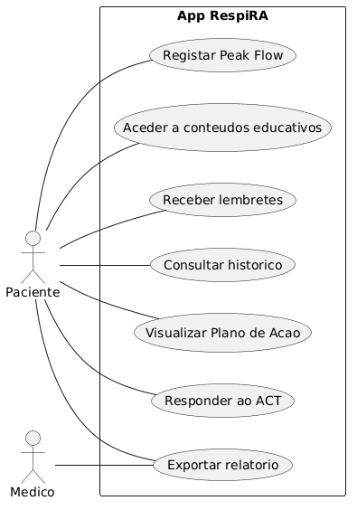

# Protocolo de Ensaio Clínico

## Informação Administrativa

### Título do Estudo

Eficácia da Intervenção Digital com a Aplicação Móvel RespiRA - Integrando Monitorização de Sintomas (ACT), Registo de Peak Flow e Plano de Ação Personalizado - Comparada com o Cuidado Habitual Isolado no Controlo Clínico da Asma Moderada Persistente em Adultos entre os 18 e 65 Anos: Um Ensaio Clínico Controlado e Aleatorizado de 12 Semanas em Cuidados de Saúde Primários para Avaliação do Score ACT, Taxa de Exacerbações e Qualidade de Vida.

### Título Abreviado

RespiRA: Controlo Digital da Asma em Adultos

### Autores e Afiliações

**Investigadores Principais:** - Beatriz Martins, - Clara Figueiras, - Matilde Ascensão, - Rita Torres.

**Instituição:** Faculdade de Medicina da Universidade do Porto

**Contacto:** Email: \[up202505167\@up.pt\]

### Identificação do Ensaio

**Tipo de estudo:** Estudo Experimental: Ensaio Clínico Controlado Aleatorizado (RCT) – Fase Piloto/Pré-teste.

**Data de início prevista:** 1 de setembro de 2026

**Data de conclusão prevista:** 31 de dezembro de 2026

------------------------------------------------------------------------

## 1. Introdução

### 1.1 Racional

A asma é uma das doenças crónicas mais prevalentes em Portugal, afetando aproximadamente 700 000 adultos. A nível global, a asma moderada a grave representa um fardo socioeconómico significativo devido à perda de produtividade e ao consumo de recursos de saúde. Apesar da eficácia das terapêuticas inalatórias atuais, estima-se que mais de 50% dos doentes não tenham a sua asma adequadamente controlada, resultando em exacerbações evitáveis e numa qualidade de vida subótima. O modelo de cuidado convencional, focado em consultas presenciais esporádicas nos cuidados de saúde primários, apresenta limitações críticas. A gestão da asma depende fortemente do autocuidado diário e da monitorização de sintomas, mas os doentes frequentemente falham na identificação precoce de sinais de agravamento e na adesão rigorosa ao plano terapêutico. Além disso, o material educativo estático e em papel raramente motiva mudanças comportamentais sustentadas. A saúde digital surge como uma solução promissora. Evidências recentes sugerem que intervenções baseadas em mHealth (Mobile Health) podem melhorar o controlo da asma ao facilitar a monitorização em tempo real e a educação personalizada. Contudo, existe ainda um gap específico na integração destas ferramentas no contexto prático do sistema de saúde português, particularmente no que toca à utilização combinada de questionários validados (ACT), registos físicos de peak flow e planos de ação automáticos. O estudo RespiRA pretende preencher esta lacuna, avaliando se uma solução integrada e intuitiva consegue converter dados de monitorização em resultados clínicos tangíveis. A escolha do comparador (cuidado habitual) justifica-se pela necessidade de demonstrar a mais-valia incremental da app face ao padrão de cuidados atual. Num sistema de recursos finitos, é ético e metodologicamente necessário provar que a tecnologia oferece benefícios superiores à prática clínica standard antes de uma implementação em larga escala. A relevância clínica deste estudo é elevada: ao capacitar o doente com ferramentas de autogestão e alertas de risco, espera-se não só uma melhoria na pontuação do ACT e na função pulmonar, mas também uma redução drástica no recurso a serviços de urgência. O impacto esperado é a transição de um modelo reativo para um modelo preventivo e personalizado, otimizando a saúde respiratória do adulto em idade ativa.

### 1.2 Objetivos

#### Objetivo Primário

O objetivo primário deste estudo é avaliar se a utilização da aplicação móvel RespiRA, como complemento ao cuidado habitual em cuidados de saúde primários, melhora o controlo da asma em adultos com asma moderada persistente, medido através da variação do Asthma Control Test (ACT) ao fim de 12 semanas de acompanhamento.

#### Objetivos Secundários

Os objetivos secundários deste estudo são:

1.  Avaliar o impacto da utilização da aplicação RespiRA nos valores de débito expiratório máximo (peak flow) ao longo do período de acompanhamento.
2.  Determinar se a intervenção está associada a uma redução no número de exacerbações de asma durante as 12 semanas de estudo.
3.  Avaliar o efeito da aplicação na adesão à medicação de controlo da asma prescrita.
4.  Analisar alterações na qualidade de vida relacionada com a asma, medida através do Asthma Quality of Life Questionnaire (AQLQ).
5.  Avaliar diferenças entre grupos no número de episódios de recurso ao serviço de urgência por agravamento de sintomas respiratórios e na satisfação dos participantes com os cuidados recebidos.

------------------------------------------------------------------------

## 2. Métodos

### 2.1 Desenho do Estudos

Este é um ensaio clínico randomizado, controlado, de grupos paralelos.

**Características do desenho:**

Este é um ensaio clínico randomizado, controlado, de grupos paralelos, destinado a avaliar a viabilidade e o efeito potencial de uma intervenção digital para autogestão da asma em cuidados de saúde primários. O estudo terá dois braços com randomização 1:1: intervenção (acesso à aplicação RespiRA) e controlo (cuidado habitual). Esta proporção garante comparabilidade e eficiência estatística numa amostra piloto reduzida. O período de intervenção terá 12 semanas, conduzido num único centro de saúde ou USF. A amostra total será de 30 participantes, 15 em cada grupo, tendo sido excluídos da amostra inicial 50 participantes (35 que não atendem aos critérios de participação, 10 que desistiram e 5 por outras razões). Após avaliação basal, os participantes serão randomizados e iniciarão o acompanhamento, permitindo avaliar aceitabilidade da aplicação, viabilidade do recrutamento e recolha de dados.

**Timeline:**

| Fase | Duração | Descrição |
|:-----------------------|:-----------------------|:-----------------------|
| Recrutamento | 4-6 semanas | Identificação e seleção de participantes elegíveis em consultas de cuidados de saúde primários |
| Baseline | 1–3 dias | Avaliação inicial, recolha de dados clínicos e randomização |
| Intervenção | 12 semanas | Utilização da aplicação RespiRA ou manutenção de cuidado habitual |
| Follow-up | 12 semanas | Avaliações de outcomes às 4, 8 e 12 semanas |

### Diagrama CONSORT

```{mermaid}
graph TD
    %% Nós principais
    A["<b>Avaliados para elegibilidade</b><br>n=80"] --> B{ }
    
    %% Ramo dos Excluídos
    B -- "Excluídos" --> C["<b>Excluídos</b><br>* Não atendem aos critérios n=35<br>* Desistiram de participar n=10<br>* Outras razões n=5"]
    
    %% Fluxo Central
    B --> N2["Consentimento Informado"]
    N2 --> D["<b>Randomizados</b><br>n=30"]
    
    %% Alocação em colunas
    D --> E1["<b>Alocação: Grupo Intervenção</b>"]
    D --> E2["<b>Alocação: Grupo Controlo</b>"]
    
    %% Intervenção
    E1 --> F1["Receberam a intervenção alocada n=15<br><i>Download e onboarding da App RespiRA</i>"]
    E2 --> F2["Receberam o cuidado habitual n=15<br><i>Consultas de rotina e material standard</i>"]
    
    %% Seguimento
    F1 --> G1["<b>Seguimento (12 semanas)</b>"]
    F2 --> G2["<b>Seguimento (12 semanas)</b>"]
    
    %% Perdas
    G1 --> H1["Perda de seguimento n=0<br><i>Descontinuação da intervenção n=0</i>"]
    G2 --> H2["Perda de seguimento n=0<br><i>Descontinuação da intervenção n=0</i>"]
    
    %% Análise
    H1 --> I1["<b>Analisados (ITT)</b><br>n=15"]
    H2 --> I2["<b>Analisados (ITT)</b><br>n=15"]

    %% Estilização
    style E1 fill:#d1c4e9,stroke:#512da8,stroke-width:2px
    style E2 fill:#f5f5f5,stroke:#9e9e9e,stroke-width:2px
    style B fill:#fff,stroke:#333,stroke-width:1px
```

### Diagrama de Atividades - Percurso do Paciente

```{mermaid}
graph TD
    A[Identificacao do Paciente] --> B[Avaliacao de Elegibilidade]
    B --> C{Cumpre criterios?}
    C -- Nao --> D[Exclusao]
    C -- Sim --> E[Consentimento Informado]
    E --> F[Avaliacao Baseline]
    F --> G[Randomizacao]
    G --> H[Grupo Intervencao]
    G --> I[Grupo Controlo]
    H --> J[Utilização da App RespiRA]
    I --> K[Cuidado Habitual]
    J --> L[Avaliacao de Follow-up]
    K --> L
    L --> M[Analise Final]
```

### 2.2 População do Estudo

#### 2.2.1 Critérios de Inclusão

Serão elegíveis para participação neste estudo indivíduos que cumpram **todos** os seguintes critérios:

1.  Idade: Entre 18 e 65 anos no momento da inclusão.
2.  Diagnóstico: Asma moderada persistente confirmada por médico assistente, segundo critérios clínicos compatíveis com recomendações internacionais (ex.: GINA).
3.  Seguimento clínico: Seguimento regular em cuidados de saúde primários com prescrição ativa de terapêutica de controlo da asma.
4.  Capacidade tecnológica: Possuir smartphone compatível com Android ou iOS e capacidade para instalar e utilizar aplicações móveis.
5.  Literacia: Compreender instruções escritas em português e responder a questionários clínicos.
6.  Consentimento informado: Disponibilidade para fornecer consentimento escrito antes de qualquer procedimento.
7.  Disponibilidade: Participar durante as 12 semanas do estudo.

#### 2.2.2 Critérios de Exclusão

Serão excluídos do estudo indivíduos que apresentem **qualquer** dos seguintes critérios:

1.  Condições médicas incompatíveis: Doenças pulmonares crónicas relevantes ou outras condições que interfiram na avaliação do controlo da asma.
2.  Exacerbação recente: Hospitalização ou tratamento sistémico intensivo nas últimas 4 semanas.
3.  Tratamentos concomitantes: Participação em outro ensaio clínico intervencional.
4.  Contraindicações específicas: Incapacidade física ou cognitiva para utilização da aplicação ou medições de peak flow.
5.  Barreiras tecnológicas: Ausência de smartphone ou ligação à internet necessária.
6.  Outras condições: Perturbações psiquiátricas graves não controladas ou situações que comprometam segurança ou adesão.

#### 2.2.3 Processo de Recrutamento

Os participantes serão identificados através de listas de utentes com diagnóstico de asma no sistema clínico eletrónico. Médicos e profissionais de saúde poderão sinalizar candidatos elegíveis em consultas de rotina. Após esclarecimento de dúvidas e confirmação dos critérios, os participantes assinarão o consentimento informado, realizarão avaliação basal e serão randomizados para um dos dois braços do estudo.

### 2.3 Intervenções

#### 2.3.1 Grupo de Intervenção

Os participantes randomizados para o grupo de intervenção receberão:

**Aplicação \[RespiRA\]:**

### Diagrama de Casos de Uso: Funcionalidades da App RespiRA



Funcionalidades principais: 1. Monitorização integrada (ACT e Peak Flow) O que faz: A aplicação combina a autoavaliação semanal pelo Asthma Control Test (ACT) com o registo diário do peak flow, permitindo monitorização contínua do controlo da asma. Os dados são processados e apresentados em gráficos evolutivos. Como o participante interage: O participante responde ao ACT e insere valores de peak flow, recebendo interpretação imediata do controlo. Frequência de uso esperada:: Semanal (ACT) e diária ou conforme orientação clínica (peak flow). Para que a aplicação RespiRa forneça um feedback imediato ao utilizador, o valor do débito expiratório máximo (PEF) registado é comparado com o valor previsto para a sua idade e ealtura (PEF previsto), utilizando a seguinte equação:

$$PEF previsto= (Altura *5.48)-(Idade*0.03)-1.58$$

Com base nesta relação, a aplicação define automaticamente o plano de ação através de um sistema de cores: -Zona verde (Controlado): PEF registo \>80% do PEF previsto -Zona amarela (Necessária vigilância):50%\<= PEF registado \<=80% do PEF previsto -Zona Vermelha (Emergência): PEF registado\<50% do PEF previsto

2.  Plano de ação e alertas O que faz: Algoritmos classificam o estado da asma e fornecem recomendações personalizadas e alertas em caso de agravamento. Como o participante interage: Feedback automático após inserção de dados ou valores anormais. Frequência de uso esperada: Conforme introdução de dados ou alterações clínicas.

3.  Adesão e educação O que faz: Inclui lembretes de medicação e conteúdos educativos sobre autogestão da asma. Como o participante interage: Recebe notificações e acede a materiais educativos. Frequência de uso esperada: Diária (lembretes) e conforme necessidade (educação).

**Instalação e Onboarding:**

A instalação da aplicação RespiRA será presencial na consulta inicial, com apoio do investigador para garantir o download da versão correta. Após registo seguro, será configurado o perfil clínico basal, incluindo limites de peak flow. O participante receberá formação breve sobre ACT, registos e interpretação de alertas, assegurando autonomia e ativação de notificações.

**Suporte técnico:**

Será contínuo, com resolução de falhas, monitorização da utilização e assistência personalizada para promover adesão e correta navegação, garantindo integridade dos dados.

**Cuidado concomitante:**

Os participantes manterão o cuidado habitual, incluindo consultas, medicação e acompanhamento clínico.

### Diagrama de Atividades: Percurso na App RespiRA

```{mermaid}
graph TD
    A[Abertura da App] --> B[Login ou Registo]
    B --> C[Configuracao do perfil e dados iniciais]
    C --> D[Painel principal - Dashboard]
    D --> E{Escolha de funcao}
    E --> F[Registo de sintomas - ACT]
    F --> G[Registo de Peak Flow]
    G --> H[Algoritmo de analise]
    H --> I[Feedback: plano de acao]
    E --> J[Consulta de materiais educativos]
    E --> L[Configuracao de lembretes de medicacao]
    I --> M[Notificacao e sugestao de conduta]
    J --> N[Aumento da literacia em saude]
    L --> O[Melhoria da adesao terapeutica]
    M --> P[Saida ou continuacao do uso]
    N --> P
    O --> P
```

#### 2.3.1.1 Fluxo de Funcionamento da App (Diagrama de Sequência)

```{mermaid}
sequenceDiagram
    autonumber
    title Fluxo Integrado RespiRA: Monitorização ACT/PEF e Plano de Ação

    participant P as Paciente (User)
    participant App as App RespiRA (Interface)
    participant Alg as Algoritmo Clínico (Cálculo)
    participant S as Servidor Seguro (RGPD/SaaS)

    Note over P, App: Rotina Semanal (ACT) ou Diária (PEF)
    P->>App: Insere Dados (Respostas ACT / Valor PEF)
    activate App
    
    Note over App, Alg: Validação de Parâmetros Clínicos
    App->>Alg: Solicita Análise (PEF real vs Previsto)
    activate Alg
    
    Note right of Alg: PEF_prev = (Altura*5.48) - (Idade*0.03) - 1.58
    Alg-->>App: Retorna % de Controlo e Score ACT
    deactivate Alg

    alt Zona Verde (Controlado: > 80% PEF / ACT >= 20)
        App->>P: Feedback: Asma Controlada. Manter plano.
    else Zona Amarela (Vigilância: 50-80% PEF / ACT 16-19)
        App->>P: Alerta: Controlo Subótimo. Reforçar medicação.
        App->>P: Notifica: Lembrete automático de adesão
    else Zona Vermelha (Emergência: < 50% PEF / ACT <= 15)
        App->>P: ALERTA CRÍTICO: Crise de Asma Detetada
        App->>P: Instrução: Contactar SNS24 (808 24 24 24) ou 112
    end

    Note over App, S: Encriptação de Dados (Protocolo HTTPS)
    App->>S: Sincronização Pseudonimizada (Back-up)
    activate S
    S-->>App: Confirmação de Segurança (RGPD Compliant)
    deactivate S
    
    deactivate App
    Note over P, S: Dados consolidados para análise estatística (ITT)
```

#### 2.3.2 Grupo Controlo

Os participantes randomizados para o grupo controlo receberão:

**Tipo de controlo: Cuidado habitual**

Receberá exclusivamente o cuidado habitual disponibilizado nos cuidados de saúde primários, incluindo consultas de seguimento, medicação prescrita e material educativo standard. Não terá acesso à aplicação RespiRA nem a ferramentas digitais adicionais.

**Justificação do comparador**

Permite avaliar o benefício incremental da intervenção digital em relação à prática clínica corrente, refletindo condições reais de prestação de cuidados.

#### 2.3.3 Critérios de Descontinuação

Participantes serão retirados do estudo se:

1.  Retirarem voluntariamente o consentimento informado a qualquer momento.
2.  Desenvolverem uma condição clínica que impeça a continuação segura do estudo.
3.  Ocorrer violação grave do protocolo ou perda de seguimento prolongada que comprometa a recolha de dados.

------------------------------------------------------------------------

## 3. Avaliações e Outcomes

### 3.1 Outcome Primário

Asthma Control Test (ACT)

-   **Instrumento:** Questionário validado composto por cinco itens que avaliam sintomas, limitação de atividades e uso de medicação de alívio nas últimas semanas. A pontuação total varia entre 5 e 25, sendo valores mais elevados indicativos de melhor controlo da asma.
-   **Momento de avaliação:** Baseline e avaliação final às 12 semanas.
-   **Definição de sucesso:** Melhoria no controlo da asma avaliada através da variação da pontuação total entre baseline(t0) e o final do período de intervenção (t12), calculada pela equação:

$$\Delta ACT=ACT_{t12} - ACT_{t0}$$

onde: $\Delta ACT$: Variação da pontuação do Asthma Control Test. $ACT_{t12}$: Pontuação obtida na 12ª semana. \*$ACT_{t0}$:Pontuação obtida no baseline.

### 3.2 Outcomes Secundários

1.  Valores de débito expiratório máximo (peak flow) registados ao longo do estudo.
2.  Número de exacerbações de asma durante o período de acompanhamento.
3.  Taxa de adesão à medicação prescrita para controlo da asma.
4.  Qualidade de vida relacionada com a asma, medida pelo Asthma Quality of Life Questionnaire (AQLQ).
5.  Número de episódios de recurso ao serviço de urgência por agravamento de sintomas respiratórios.
6.  Satisfação dos participantes com os cuidados recebidos durante o estudo.

------------------------------------------------------------------------

## 4. Métodos: Análise Estatística

A análise estatística será conduzida segundo o princípio da intenção de tratar (intention-to-treat, ITT), incluindo todos os participantes de acordo com a alocação inicial. Será adicionalmente realizada uma análise por protocolo como abordagem complementar, considerando apenas os participantes com adesão adequada à intervenção e aos procedimentos definidos. Dada a natureza piloto e o reduzido tamanho amostral (n=30), a análise terá caráter exploratório, com foco na estimativa de magnitudes de efeito e respetiva variabilidade. As variáveis contínuas serão descritas através de média e desvio padrão ou mediana e intervalo interquartil, conforme a distribuição, avaliada por testes de normalidade. As variáveis categóricas serão apresentadas como frequências absolutas e relativas. Para o outcome primário (variação do score ACT entre baseline e 12 semanas), será utilizada comparação entre grupos com recurso ao teste t para amostras independentes ou teste de Mann-Whitney, conforme apropriado. Poderá ser aplicado um modelo de análise de covariância (ANCOVA), ajustado ao valor basal do ACT, com o objetivo de melhorar a precisão da estimativa do efeito da intervenção. Os outcomes secundários serão analisados de acordo com a sua natureza. Os valores de peak flow ao longo do tempo serão avaliados com modelos de medidas repetidas, nomeadamente modelos lineares mistos, permitindo considerar a correlação intraindivíduo e a evolução temporal. O número de exacerbações e episódios de recurso ao serviço de urgência será analisado através de modelos de regressão para dados de contagem (Poisson ou binomial negativa). A adesão terapêutica, qualidade de vida e satisfação serão comparadas entre grupos com testes paramétricos ou não paramétricos adequados. Serão reportadas estimativas de efeito com intervalos de confiança a 95%, privilegiando a interpretação clínica. O nível de significância será fixado em α=0,05. A gestão de dados em falta será realizada através de métodos apropriados, incluindo imputação quando aplicável, acompanhada de análises de sensibilidade. As análises serão efetuadas com software estatístico validado.

------------------------------------------------------------------------

## 5. Ética e Disseminação

O estudo será conduzido em conformidade com a Declaração de Helsínquia e as normas de Boa Prática Clínica. O protocolo será previamente submetido e aprovado por uma Comissão de Ética para a Investigação em Saúde antes do início do recrutamento. Todos os participantes fornecerão consentimento informado por escrito após esclarecimento adequado sobre os objetivos, procedimentos, riscos e benefícios. Será garantido o direito de desistência a qualquer momento, sem prejuízo dos cuidados de saúde habituais. A proteção de dados será assegurada em conformidade com o Regulamento Geral sobre a Proteção de Dados (RGPD). Os dados clínicos e digitais serão pseudonimizados e armazenados em sistemas seguros, com acesso restrito à equipa de investigação. Serão implementadas medidas técnicas e organizativas para prevenir acessos não autorizados ou perda de informação. Atendendo à natureza digital da intervenção, será garantida a segurança dos dados gerados pela aplicação, incluindo autenticação e encriptação. Eventos adversos serão monitorizados e reportados conforme os procedimentos definidos. Os resultados serão disseminados independentemente dos achados, através de publicações científicas e apresentações em congressos. Será promovida a partilha com participantes e instituições, contribuindo para a transparência científica e potencial integração futura da intervenção na prática clínica.

------------------------------------------------------------------------

**Versão:** 1.0\
**Data desta versão:** 2026-04-30 **Autores desta versão:** Beatriz Martins, Clara Figueiras, Matilde Ascensão, Rita Torres.
